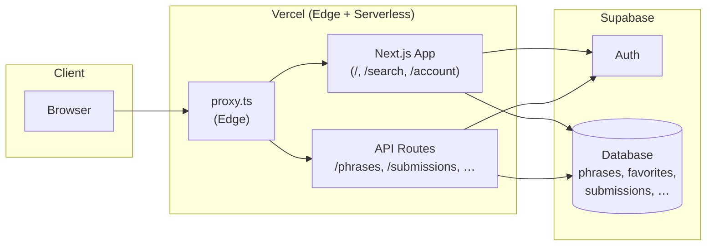
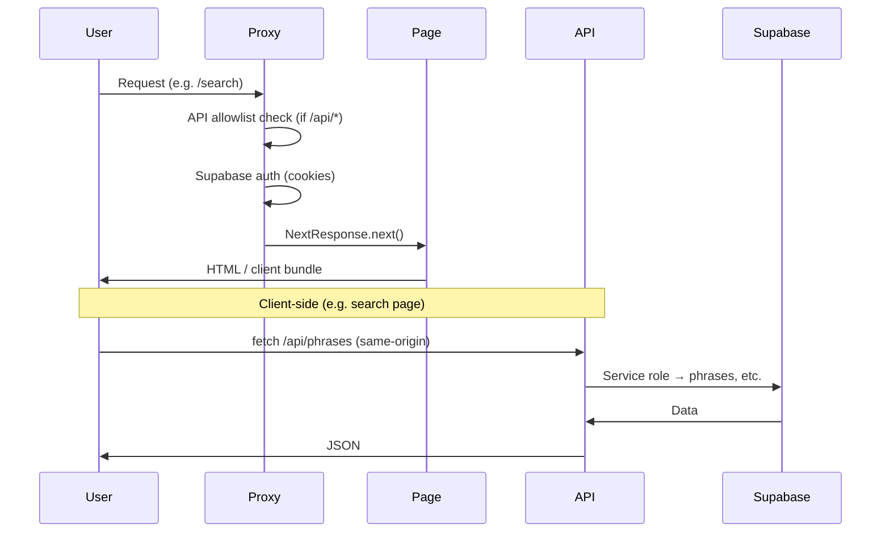
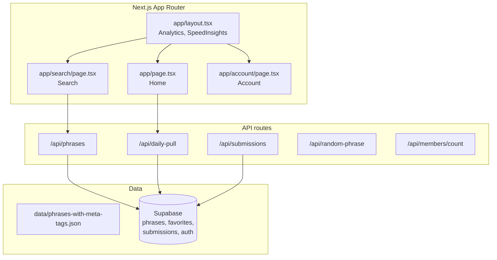

# Architecture

High-level structure of ʻŌlelo Noʻeau Search.

## System overview

## Request flow

## App structure

## Security

- **API:** Only same-origin or requests with `x-internal-secret` (see `lib/api-auth.ts`) can call `/api/*`.
- **Supabase:** RLS on tables; service role used only in API routes (server-side).
- **Proxy:** Runs on Edge; handles auth cookie refresh and API allowlist.

---

Mermaid diagrams render on GitHub and in many editors. Edit this file to keep the chart in sync with the project.
